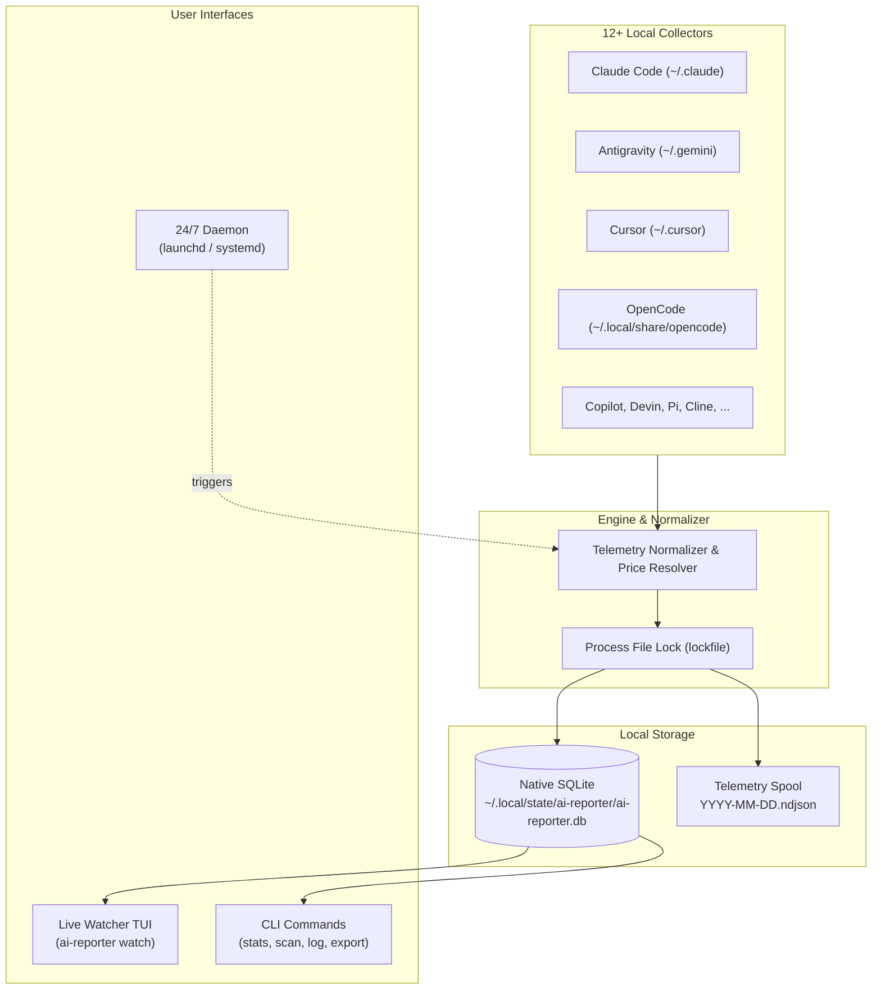

<p align="center">
  <h1 align="center">AI-Reporter ✦</h1>
  <p align="center">
    <strong>24/7 AI token & cost tracker for all your local AI coding agents.</strong><br>
    Continuous background monitoring · Real-time spend & cache savings · Zero cloud dependencies · 100% Private
  </p>
</p>

<p align="center">
  <a href="LICENSE"></a>
  <a href="#-quick-install-macos--linux"></a>
  <a href="https://nodejs.org"></a>
  <a href="#-privacy--local-first-architecture"></a>
  <a href="#-acknowledgments--citation-the-hackspain-project"></a>
</p>

---

## ✦ Table of Contents

- [Overview](#-overview)
- [Acknowledgments & Citation: The HackSpain Project](#-acknowledgments--citation-the-hackspain-project)
- [Quick Install (macOS & Linux)](#-quick-install-macos--linux)
- [Supported Harnesses & Agents](#-supported-harnesses--agents)
- [Quick Start](#-quick-start)
- [Core Features & Commands](#-core-features--commands)
  - [1. Real-Time TUI Dashboard (`ai-reporter watch`)](#1-real-time-tui-dashboard-ai-reporter-watch)
  - [2. Catch-up Scanning (`ai-reporter scan`)](#2-catch-up-scanning-ai-reporter-scan)
  - [3. Usage & Spend Analytics (`ai-reporter stats`)](#3-usage--spend-analytics-ai-reporter-stats)
  - [4. 24/7 Background Service (`ai-reporter service`)](#4-247-background-service-ai-reporter-service)
  - [5. Transaction Logs (`ai-reporter log`)](#5-transaction-logs-ai-reporter-log)
  - [6. Model Pricing Catalog (`ai-reporter pricing`)](#6-model-pricing-catalog-ai-reporter-pricing)
  - [7. Export Data (`ai-reporter export`)](#7-export-data-ai-reporter-export)
- [Architecture & How It Works](#-architecture--how-it-works)
- [Privacy & Local-First Architecture](#-privacy--local-first-architecture)
- [Development & Testing](#-development--testing)
- [License](#-license)

---

## ⚡ Overview

Modern AI-assisted development often involves juggling multiple AI agents and coding tools: **Claude Code** for command-line problem solving, **Antigravity** for deep agentic workflows, **Cursor** or **Cline** in the editor, **GitHub Copilot CLI** for quick shell assists, and **OpenCode** or **Devin** for long-running autonomous tasks. 

Every single prompt, completion, and cache turn consumes tokens and adds up to monetary spend—yet visibility across disparate tools has historically been fragmented or nonexistent.

**AI-Reporter** solves this problem by running locally on your machine to monitor and aggregate every token across all your tools. It automatically normalizes session logs into a unified, high-performance SQLite database, estimates costs using pre-configured and custom model pricing tables, and visualizes token usage and prompt-caching savings through a live terminal UI.

---

## 🏆 Acknowledgments & Citation: The HackSpain Project

**AI-Reporter was directly inspired by the architecture of the HackSpain CLI Watcher**, created for **HackSpain 2026** ([HackSpain/hackspain26](https://github.com/HackSpain/hackspain26)).

### About HackSpain 2026
[HackSpain](https://hackspain.com) is the premier hackathon for young technical talent in Spain, organized by the [Asociación Exponential Fellowship](https://hackspain.com). The 2026 edition brought together 250 top builders at UPM-ETSIT in Madrid from 18 to 20 September 2026 for 36 hours of intensive development.

During the hackathon, the HackSpain team authored a terminal client (`hackspain watch`) that continuously inspected local session logs from a wide matrix of AI coding assistants to report live participant compute metrics and power the real-time arena TV leaderboard.

### How AI-Reporter Builds Upon HackSpain
AI-Reporter adopts and expands upon the multi-agent collector paradigms pioneered by HackSpain, transforming the concept from a hackathon telemetry uploader into a **complete, standalone, 24/7 personal token & cost analytics engine**:

- **100% Local & Zero Cloud Telemetry**: Unlike the hackathon watcher which uploaded usage to an event server, AI-Reporter stores everything on your local machine using Node 22's native SQLite engine (`node:sqlite`). No data ever leaves your computer.
- **Accurate Dollar Pricing & Cache Savings**: Evaluates prompt costs, completion costs, and calculates exact dollar amounts saved by prompt caching across Anthropic, OpenAI, Google, DeepSeek, and Mistral models.
- **24/7 Background Daemons**: Fully integrated background service management for macOS (`launchd`) and Linux (`systemd --user`), ensuring every token is accounted for even when no terminal is open.
- **Privacy Hardening**: SHA-256 hashing for all project paths and zero retention of prompts, completions, or tool outputs.

### Citation
If you use AI-Reporter or reference its lineage in academic work, technical articles, or open-source tooling, please cite both this repository and the original HackSpain project:

```bibtex
@misc{hackspain2026,
  author       = {{HackSpain} and {Asociaci{\'o}n Exponential Fellowship}},
  title        = {HackSpain 2026: The Landing, Participant Dashboard and Terminal Client},
  year         = {2026},
  publisher    = {GitHub},
  journal      = {GitHub repository},
  howpublished = {\url{https://github.com/HackSpain/hackspain26}}
}

@misc{aireporter2026,
  author       = {Moreno S{\'a}nchez, Francisco},
  title        = {AI-Reporter: 24/7 AI Token \& Cost Tracker for Local AI Coding Agents},
  year         = {2026},
  publisher    = {GitHub},
  journal      = {GitHub repository},
  howpublished = {\url{https://github.com/wall3n/ai-reporter}}
}
```

- **HackSpain Repository**: [https://github.com/HackSpain/hackspain26](https://github.com/HackSpain/hackspain26)
- **HackSpain Website**: [https://hackspain.com](https://hackspain.com)
- **HackSpain Dashboard**: [https://hackspain.app](https://hackspain.app)

---

## 🚀 Quick Install (macOS & Linux)

### One-line Install via `curl`

Install AI-Reporter into `~/.local/bin/ai-reporter`:

```sh
curl -fsSL https://raw.githubusercontent.com/wall3n/ai-reporter/main/install.sh | bash
```

The installer will:
1. Detect your operating system (macOS / Linux) and architecture.
2. Verify **Node.js >= 22.0.0** (required for native `node:sqlite`).
3. Download the standalone bundle and place the executable wrapper in `~/.local/bin/ai-reporter`.
4. Verify your `$PATH` and provide instructions if `~/.local/bin` is not yet configured.

#### Customizing Installation Paths

You can customize the installation target via environment variables:

```sh
# Example: Install to custom directory
AI_REPORTER_INSTALL_DIR="/usr/local/bin" curl -fsSL https://raw.githubusercontent.com/wall3n/ai-reporter/main/install.sh | bash
```

### Alternative: Install from Source

If you prefer building and installing directly from a local clone:

```sh
git clone https://github.com/wall3n/ai-reporter.git
cd ai-reporter
pnpm install
pnpm build
./install.sh
```

---

## ⚡ Supported Harnesses & Agents

AI-Reporter natively scans and tracks 12+ coding agents and harnesses:

| Harness | Glyph | Supported Environments | Local Data Source |
|---|:---:|---|---|
| **Antigravity** | `◠` | Antigravity CLI, Desktop, IDE | `~/.gemini/{antigravity-cli,antigravity,antigravity-ide}/conversations/*.db` |
| **Claude Code** | `✻` | Anthropic Claude Code CLI & Desktop | `~/.claude/projects/*/*.jsonl` |
| **Cursor** | `▍` | Cursor AI Editor & Agent | `~/.cursor/hooks.json` (`afterAgentResponse` & `stop`) |
| **OpenCode** | `◆` | OpenCode AI Coding Agent | `~/.local/share/opencode/opencode.db` |
| **GitHub Copilot** | `◉` | GitHub Copilot CLI | `~/.copilot/session-state/*/events.jsonl` |
| **Google Gemini CLI**| `✦` | Google Gemini CLI | `~/.gemini/tmp/*/chats/session-*.jsonl` |
| **OpenAI Codex** | `⬡` | OpenAI Codex CLI | `~/.codex/sessions/**/rollout-*.jsonl` |
| **Cline / Roo Code**| `▣` | Cline & Roo Code VS Code Extensions| `globalStorage/saoudrizwan.claude-dev/tasks/*/ui_messages.json` |
| **Devin** | `◈` | Devin CLI | `~/.local/share/devin/cli/sessions.db` |
| **Pi & Oh My Pi** | `π` | Pi Agent & Oh My Pi (OMP) | `~/.pi/agent/sessions/` & `~/.omp/agent/sessions/` |
| **Qwen Code** | `❋` | Qwen Code CLI | `~/.qwen/projects/*/chats/*.jsonl` |
| **Kilo Code** | `⬢` | Kilo Code | `~/.local/share/kilo/kilo*.db` |

---

## 🏁 Quick Start

### 1. Catch-up Scan
Recover your full historical token usage across every agent installed on your machine:

```sh
ai-reporter scan
```

### 2. Launch the Live Watcher TUI
Open an interactive real-time dashboard:

```sh
ai-reporter watch
```

### 3. Inspect Spend & Usage Statistics
Review aggregate spend, cache efficiency, and breakdowns:

```sh
ai-reporter stats
```

### 4. Enable 24/7 Background Tracking
Keep tracking every token automatically across system reboots:

```sh
# On macOS (launchd) or Linux (systemd user service)
ai-reporter service install
```

---

## 📊 Core Features & Commands

### 1. Real-Time TUI Dashboard (`ai-reporter watch`)

Launch an interactive full-screen dashboard in your terminal:

```sh
ai-reporter watch
```

```
  AI REPORTER
  24/7 AI Token & Spend Tracker · All Coding Agents

  ╭─ Tokens ──────────────╮ ╭─ Cost ───────────────╮ ╭─ Prompt Cache ───────╮
  │ 1.1B tokens           │ │ $478.62 est. spend   │ │ $2780.36 saved       │
  │ Prompt: 10.8M         │ │ Input: $32.40        │ │ Read: 1.1B           │
  │ Compl:  5.2M          │ │ Output: $78.00       │ │ Written: 26.8M       │
  ╰───────────────────────╯ ╰──────────────────────╯ ╰──────────────────────╯

  ✦ Active AI Harnesses:
  Harness        Status    Requests  Tokens  Prompt  Compl   Cached  Last Active
  ─────────────  ────────  ────────  ──────  ──────  ──────  ──────  ───────────
  ✻ Claude Code  ● active  6.1k      1.1B    12.1k   4.5M    1.1B    just now
  ◠ Antigravity  ● active  1k        74.6M   10.4M   608.5k  63.6M   2m ago
  ◆ OpenCode     ○ idle    215       11.6M   469.1k  110.9k  11.1M   1h ago

  ✦ Recent Requests:
  19:58:12  ✻ claude-opus-5    42.1k tok  ($0.0189)  Hackspain-2026---Embat-track
  19:57:45  ◠ gemini-3-8-flash 18.4k tok  ($0.0007)  ai-reporter
```

#### Interactive Hotkeys
- <kbd>q</kbd> : Quit watcher
- <kbd>p</kbd> : Pause / resume file scanning
- <kbd>s</kbd> : Trigger an immediate scan now
- <kbd>r</kbd> : Refresh screen

> [!NOTE]
> When the 24/7 background service is active, `ai-reporter watch` automatically connects in **Live Stream Mode**, displaying real-time updates seamlessly without conflicting with background locks.

---

### 2. Catch-up Scanning (`ai-reporter scan`)

Perform an immediate scan of all supported harnesses and persist newly discovered events:

```sh
ai-reporter scan
```

Use `--verbose` to inspect individual collector progress.

---

### 3. Usage & Spend Analytics (`ai-reporter stats`)

Generate detailed usage summaries and ASCII trend visualizations:

```sh
# All-time statistics
ai-reporter stats

# Time-filtered analytics
ai-reporter stats --today
ai-reporter stats --yesterday
ai-reporter stats --week
ai-reporter stats --month

# Structured JSON for external dashboards or scripts
ai-reporter stats --json
```

Outputs include:
- Total Prompt, Completion, Cache Read, and Cache Write tokens.
- Total Estimated Cost ($ USD) and prompt caching dollar savings.
- Breakdown by AI harness.
- Breakdown by model family and model name.
- Breakdown by project / Git repository.
- 14-day daily activity ASCII histogram.

---

### 4. 24/7 Background Service (`ai-reporter service`)

Run AI-Reporter continuously as a system daemon without keeping a terminal open:

```sh
# Install and enable the background daemon
ai-reporter service install

# Check status (PID, service file, log location)
ai-reporter service status

# Tail background daemon logs in real time
ai-reporter service logs -f

# Temporarily stop or restart the service
ai-reporter service stop
ai-reporter service start

# Remove and disable the background service
ai-reporter service uninstall
```

- **macOS**: Managed through `launchd` via `~/Library/LaunchAgents/com.ai-reporter.daemon.plist`.
- **Linux**: Managed through `systemd --user` via `~/.config/systemd/user/ai-reporter.service`.

---

### 5. Transaction Logs (`ai-reporter log`)

Inspect individual token transactions:

```sh
# View recent 25 transactions
ai-reporter log

# Filter by harness and limit
ai-reporter log --limit 50 --harness claude-code

# Output as JSON
ai-reporter log --json
```

---

### 6. Model Pricing Catalog (`ai-reporter pricing`)

AI-Reporter includes built-in pricing tables per 1M tokens for popular models from Anthropic, OpenAI, Google, DeepSeek, Mistral, and Qwen:

```sh
# List all current rates and custom overrides
ai-reporter pricing list

# Configure or override rates for any model:
# ai-reporter pricing set <model> <inputPrice> <outputPrice> [cacheReadPrice] [cacheWritePrice]
ai-reporter pricing set custom-claude-model 3.00 15.00 0.30 3.75
```

Custom rates are persisted to `~/.config/ai-reporter/pricing.json`.

---

### 7. Export Data (`ai-reporter export`)

Export your raw token events for analysis in spreadsheets, Python, or BI dashboards:

```sh
# Export to CSV
ai-reporter export --format csv --out ~/ai-tokens.csv

# Export to JSON
ai-reporter export --format json --out ~/ai-tokens.json
```

---

## 📐 Architecture & How It Works



1. **Incremental Cursor Tracking**: Collectors maintain local byte offsets and timestamps in SQLite, ensuring each log event is ingested exactly once with negligible CPU usage.
2. **Schema Canonicalization**: Diverse formats (JSONL, SQLite, hook payloads) are mapped into a standardized `TelemetryEvent` schema: `(id, timestamp, harness, model, inputTokens, outputTokens, cacheReadTokens, cacheWriteTokens, costUsd, projectHash, projectName)`.
3. **Atomic Writes**: Node 22 native `node:sqlite` transactions write records in sub-millisecond batches.

---

## 🔒 Privacy & Local-First Architecture

AI-Reporter is built strictly for personal privacy:

- **Zero Prompt / Code Storage**: AI-Reporter **never** reads, inspects, or stores prompt text, completions, tool inputs/outputs, or code snippets. Only numerical token counts, model names, and timestamps are captured.
- **SHA-256 Project Anonymization**: Absolute file paths are never logged in the database. Working directories are hashed with SHA-256; only the repository basename (e.g. `ai-reporter`) and Git remote reference are saved for local attribution.
- **Zero Cloud Network Calls**: AI-Reporter makes zero outbound network requests. All analytics run 100% locally.

### Local File Paths

| File / Directory | Purpose |
|---|---|
| `~/.local/bin/ai-reporter` | Executable launcher wrapper |
| `~/.local/share/ai-reporter/` | Application bundle runtime files |
| `~/.local/state/ai-reporter/ai-reporter.db` | Primary SQLite database (`node:sqlite`) |
| `~/.local/state/ai-reporter/telemetry/*.ndjson` | Daily telemetry spool backup |
| `~/.local/state/ai-reporter/daemon.log` | Background daemon logs |
| `~/.config/ai-reporter/pricing.json` | Custom model pricing overrides |
| `~/Library/LaunchAgents/com.ai-reporter.daemon.plist` | macOS background daemon definition |
| `~/.config/systemd/user/ai-reporter.service` | Linux systemd background service definition |

---

## 🛠 Development & Testing

### Requirements
- **Node.js**: >= 22.0.0 (Native `node:sqlite` support)
- **Package Manager**: `pnpm` >= 9.0.0

```sh
# Install dependencies
pnpm install

# Build standalone distribution
pnpm build

# Type check TypeScript
pnpm typecheck

# Run unit and integration tests
pnpm test
```

---

## 📄 License

AI-Reporter is open-source software licensed under the [MIT License](LICENSE).

Created by **[Francisco Moreno Sánchez](https://github.com/wall3n)**. Inspired by the **[HackSpain](https://github.com/HackSpain/hackspain26)** project.
